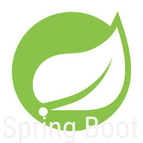

# Hi there! I'm Brittney!

I'm still learning new skills every day. I have done projects using these tools ***so far***:

    
    
    
    
    
    
    
    
     
     
     
     
     
     
     
     
     
     
     
     

### Click on the <a href='https://www.brittneyepperson.com' target="_blank">site link</a> to view more about me.
